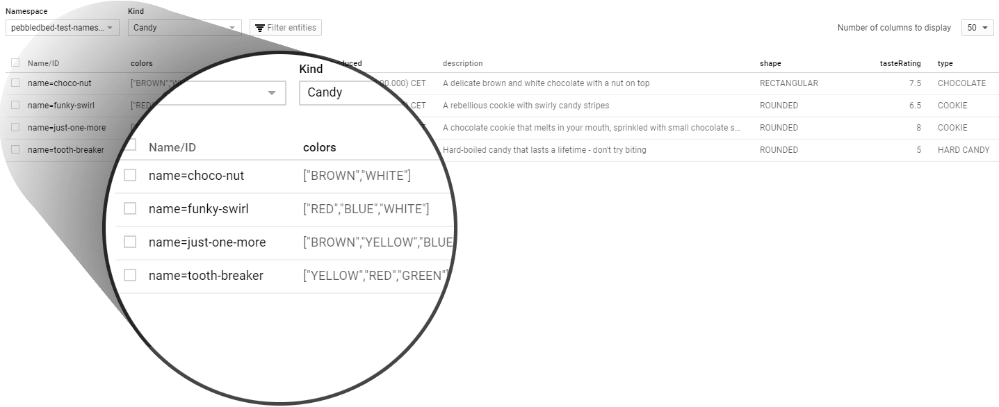

> This example takes place after the little bit of setup shown in [Getting Started](/docs)

As a very basic example we're going to use some candy to give you a little taste (heh) of how Pebblebed works.


## First, let's define what our candy entities look like (the model)

```javascript
import { Pebblebed, PebbleStringId, ...etc... PebbleDateTime } from "pebblebed";

const schema = Pebblebed.createSchema({
    candyName: PebbleStringId(),
    description: PebbleString({
      indexed: false,
    }),
    type: PebbleString().required(),
    colors: PebbleArray(),
    shape: PebbleString().only(["ROUNDED", "RECTANGULAR"]),
    tasteRating: PebbleDouble().min(0).max(10).default(5),
    dateIntroduced: PebbleDateTime()
  });

  const CandyModel = new PebblebedModel("Candy", schema);
```

Here we've created a model for our entity kind of `"Candy"` with some basic properties.
It uses Joi behind the scenes (so we can validate our data before saving),
with some custom Pebblebed helpers to cut out verbosity and target the Datastore data types.

#### Some things to note:
* `candyName` is a **String Id** - which is to say this property will form the unique key for any Candy entity saved to the database - therefore it should always be unique to each candy.
* `description` has an options object passed to it, telling Pebblebed that this property is **unindexed** (saying that it doesn't need to be queried upon later, which saves index resources)
* `type` is a **required** property - will be checked if it is present on save operations
* `shape` is a string value, and thanks to Joi we can define that it may **only** be one of a select few values which we've  passed in as an array.
* `tasteRating` is a double number value, which again can be restricted thanks to Joi. Here we've also set a **default** value of 5 if it happens to unset during a save operation.
* `dateIntroduced` will be a JavaScript Date object when loaded from the database, and should be set as one before saving too.

## Now let's throw the candy data into Datastore


